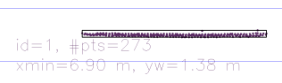

# SFND 3D Object Tracking

Welcome to the final project of the camera course. By completing all the lessons, you now have a solid understanding of keypoint detectors, descriptors, and methods to match them between successive images. Also, you know how to detect objects in an image using the YOLO deep-learning framework. And finally, you know how to associate regions in a camera image with Lidar points in 3D space. Let's take a look at our program schematic to see what we already have accomplished and what's still missing.


In this final project, you will implement the missing parts in the schematic. To do this, you will complete four major tasks: 
1. First, you will develop a way to match 3D objects over time by using keypoint correspondences. 
2. Second, you will compute the TTC based on Lidar measurements. 
3. You will then proceed to do the same using the camera, which requires to first associate keypoint matches to regions of interest and then to compute the TTC based on those matches. 
4. And lastly, you will conduct various tests with the framework. Your goal is to identify the most suitable detector/descriptor combination for TTC estimation and also to search for problems that can lead to faulty measurements by the camera or Lidar sensor. In the last course of this Nanodegree, you will learn about the Kalman filter, which is a great way to combine the two independent TTC measurements into an improved version which is much more reliable than a single sensor alone can be. But before we think about such things, let us focus on your final project in the camera course. 

## Dependencies for Running Locally
* cmake >= 2.8
  * All OSes: [click here for installation instructions](https://cmake.org/install/)
* make >= 4.1 (Linux, Mac), 3.81 (Windows)
  * Linux: make is installed by default on most Linux distros
  * Mac: [install Xcode command line tools to get make](https://developer.apple.com/xcode/features/)
  * Windows: [Click here for installation instructions](http://gnuwin32.sourceforge.net/packages/make.htm)
* Git LFS
  * Weight files are handled using [LFS](https://git-lfs.github.com/)
* OpenCV >= 4.1
  * This must be compiled from source using the `-D OPENCV_ENABLE_NONFREE=ON` cmake flag for testing the SIFT and SURF detectors.
  * The OpenCV 4.1.0 source code can be found [here](https://github.com/opencv/opencv/tree/4.1.0)
* gcc/g++ >= 5.4
  * Linux: gcc / g++ is installed by default on most Linux distros
  * Mac: same deal as make - [install Xcode command line tools](https://developer.apple.com/xcode/features/)
  * Windows: recommend using [MinGW](http://www.mingw.org/)

## OpenCV version
* This code was developed using the latest OpenCV master where SIFT has ben moved from the non-free repository to the main package.
* This means that all mentions of `SIFT` have to be replaced with `xfeatures2d::SIFT` if using an eariler version.

## Basic Build Instructions

1. Clone this repo.
2. Make a build directory in the top level project directory: `mkdir build && cd build`
3. Compile: `cmake .. && make`
4. Run it: `./3D_object_tracking`.

## Project Report

### FP.1 Match 3D Objects

**Criteria:** Implement the method "matchBoundingBoxes", which takes as input both the previous and the current data frames and provides as output the ids of the matched regions of interest (i.e. the boxID property). Matches must be the ones with the highest number of keypoint correspondences.

```cpp
void matchBoundingBoxes(std::vector<cv::DMatch> &matches, std::map<int, int> &bbBestMatches, DataFrame &prevFrame, DataFrame &currFrame)
{
    int minimum_matches = 10;
    std::map<std::pair<int,int>, int> counter; // ([prevID, currID], count)
    
    for (auto & match: matches){
        auto prevKeypoint = prevFrame.keypoints[match.queryIdx];
        auto currKeypoint = currFrame.keypoints[match.trainIdx];
        
        for(auto &prevBox : prevFrame.boundingBoxes){
            if(prevBox.roi.contains(prevKeypoint.pt)){
                for(auto &currBox: currFrame.boundingBoxes){
                    if(currBox.roi.contains(currKeypoint.pt)){
                        std::pair<int, int> id(prevBox.boxID, currBox.boxID);
                        if (counter.count(id) == 0){
                            counter[id] = 1;
                        }else{
                            counter[id]++;
                        }
                    }
                }
            }
        }
    }

    std::map<int, int> best_count; // (prev_boxID, best match count)
    for(auto &entry : counter){
        auto id = entry.first;
        auto count = entry.second;
        if(best_count.count(id.first) != 0){
            if(best_count[id.first] > count) continue;
        }
        best_count[id.first] = count;
        if(count >= minimum_matches){
            bbBestMatches[id.first] = id.second;
        }
    }
}
```

### FP.2 Compute Lidar-based TTC

**Criteria:** Compute the time-to-collision in second for all matched 3D objects using only Lidar measurements from the matched bounding boxes between current and previous frame.

```cpp
double calculateMedian(std::vector<double> &data) {
    std::sort(data.begin(), data.end());
    long medIndex = floor(data.size() / 2.0);
    return data.size() % 2 == 0 ? (data[medIndex - 1] + data[medIndex]) / 2.0 : data[medIndex]; // compute median dist. ratio to remove outlier influence
}

void computeTTCLidar(std::vector<LidarPoint> &lidarPointsPrev,
                     std::vector<LidarPoint> &lidarPointsCurr, double frameRate, double &TTC)
{
    double dT = 1.0 / frameRate;
    std::vector<double> distPrev, distCurr;
    for(auto &pt : lidarPointsPrev) distPrev.push_back(pt.x);
    for(auto &pt : lidarPointsCurr) distCurr.push_back(pt.x);

    double medianDistPrev = calculateMedian(distPrev);
    double medianDistCurr = calculateMedian(distCurr);
    TTC = medianDistCurr * dT / (medianDistPrev - medianDistCurr);
}
```

### FP.3 Associate Keypoint Correspondences with Bounding Boxes

**Criteria:** Prepare the TTC computation based on camera measurements by associating keypoint correspondences to the bounding boxes which enclose them. All matches which satisfy this condition must be added to a vector in the respective bounding box.

```cpp
void clusterKptMatchesWithROI(BoundingBox &boundingBox, std::vector<cv::KeyPoint> &kptsPrev, std::vector<cv::KeyPoint> &kptsCurr, std::vector<cv::DMatch> &kptMatches)
{
    double sum = 0;
    for(auto &match : kptMatches){
        if(boundingBox.roi.contains(kptsCurr[match.trainIdx].pt)){
            boundingBox.kptMatches.push_back(match);

            cv::KeyPoint kpCurr = kptsCurr.at(match.trainIdx);
            cv::KeyPoint kpPrev = kptsPrev.at(match.queryIdx);
            double dist = cv::norm(kpCurr.pt - kpPrev.pt);
            sum += dist;
        }
    }
    double mean = sum / boundingBox.kptMatches.size();
    double ratio = 1.5;

    // Remove outliers
    for (auto it = boundingBox.kptMatches.begin(); it < boundingBox.kptMatches.end();)
    {
        cv::KeyPoint kpCurr = kptsCurr.at(it->trainIdx);
        cv::KeyPoint kpPrev = kptsPrev.at(it->queryIdx);
        double dist = cv::norm(kpCurr.pt - kpPrev.pt);

        if (dist >= mean * ratio){
            boundingBox.kptMatches.erase(it);
        }else{
            it++;
        }
    }
}
```

### FP.4 Compute Camera-based TTC

**Criteria:** Compute the time-to-collision in second for all matched 3D objects using only keypoint correspondences from the matched bounding boxes between current and previous frame.

```cpp
void computeTTCCamera(std::vector<cv::KeyPoint> &kptsPrev, std::vector<cv::KeyPoint> &kptsCurr, 
                      std::vector<cv::DMatch> kptMatches, double frameRate, double &TTC, cv::Mat *visImg)
{
    // compute distance ratios between all matched keypoints
    vector<double> distRatios; // stores the distance ratios for all keypoints between curr. and prev. frame
    for (auto it1 = kptMatches.begin(); it1 != kptMatches.end() - 1; ++it1)
    { // outer kpt. loop

        // get current keypoint and its matched partner in the prev. frame
        cv::KeyPoint kpOuterCurr = kptsCurr.at(it1->trainIdx);
        cv::KeyPoint kpOuterPrev = kptsPrev.at(it1->queryIdx);

        for (auto it2 = kptMatches.begin() + 1; it2 != kptMatches.end(); ++it2)
        { // inner kpt.-loop

            double minDist = 100.0; // min. required distance

            // get next keypoint and its matched partner in the prev. frame
            cv::KeyPoint kpInnerCurr = kptsCurr.at(it2->trainIdx);
            cv::KeyPoint kpInnerPrev = kptsPrev.at(it2->queryIdx);

            // compute distances and distance ratios
            double distCurr = cv::norm(kpOuterCurr.pt - kpInnerCurr.pt);
            double distPrev = cv::norm(kpOuterPrev.pt - kpInnerPrev.pt);

            if (distPrev > std::numeric_limits<double>::epsilon() && distCurr >= minDist)
            { // avoid division by zero

                double distRatio = distCurr / distPrev;
                distRatios.push_back(distRatio);
            }
        } // eof inner loop over all matched kpts
    }     // eof outer loop over all matched kpts

    // only continue if list of distance ratios is not empty
    if (distRatios.size() == 0)
    {
        TTC = NAN;
        return;
    }
   
    auto medDistRatio = calculateMedian(distRatios);
    auto dT = 1 / frameRate;
    TTC = -dT / (1 - medDistRatio);
}
```

### FP.5 Performance Evaluation 1

**Criteria:** Find examples where the TTC estimate of the Lidar sensor does not seem plausible. Describe your observations and provide a sound argumentation why you think this happened. Several examples (2-3) have been identified and described in detail. The assertion that the TTC is off has been based on manually estimating the distance to the rear of the preceding vehicle from a top view perspective of the Lidar points.

Using the median depth to estimate TTC from LiDAR measurements, no estimates could be classified as not plausible. Using the minimum depth however was more susceptible to outliers with varying results. In Fig. 1 we can see that the median depth gives reasonable results, while using the minimum depth give results that are not plausible with a high degree of noise. The reason for this can be seen in Table 1 where outliers in the previous frame influence the estiamte in the consecutive frame.


**Fig. 1:** Estimated TTC using median and minimum depth from LiDAR measurements.


**Table 1:** Highlighting of outliers between consecutive frames.
Previous frame             |  Current frame
:-------------------------:|:-------------------------:
  |  
Frame 6                         | Frame 7
 |  
Frame 11                        | Frame 12
 |  
Frame 16                        | Frame 17

### FP.6 Performance Evaluation 2

**Criteria:** Run several detector / descriptor combinations and look at the differences in TTC estimation. Find out which methods perform best and also include several examples where camera-based TTC estimation is way off. As with Lidar, describe your observations again and also look into potential reasons. All detector / descriptor combinations implemented in previous chapters have been compared with regard to the TTC estimate on a frame-by-frame basis. To facilitate comparison, a spreadsheet and graph should be used to represent the different TTCs.


**Fig. 2:** TTC estimates for all combinations of keypoint descriptors and detectors.


**FIG. 3:** RMS values showing the difference between camera and median-depth LiDAR based TTC. 

From Fig. 2 it is quite clear that the ORB, Harris and BRISK detector results in quite sporadic and unusable data. Using LiDAR based TTC as ground truth we get the results in Fig. 3 where all combinations of keypoint detectors and descriptors are compared by using the RMS error between camera and LiDAR based TTC. To decide which method performs best we use the RMS values above and the match speeds found in an earlier [project](https://github.com/helgeanl/SFND_2D_Feature_Tracking). The results can then be viewed in table 2, with FAST+BRISK as the method with the highest performance, weighting accuracy and speed.


**Table 2:** Comparison of camera based TTC methods weighting accuracy and matching time.
|   | Detector+Descriptor |  RMS  | Mean match time [ms] |                                              |
|---|---------------------|-------|----------------------|----------------------------------------------|
| 1 | FAST+BRISK          | 1.94  | 5.5                  | Best allrounder comparing accuracy and speed |
| 2 | FAST+FREAK          | 1.83  | 34.11                | Accurate and relatively fast                 |
| 3 | SIFT+FREAK          | 1.58  | 91.2                 | Accurate, but slow                           |
| 4 | SIFT+SIFT           | 1.49  | 117.2                | Most accurate, but very slow                 |


